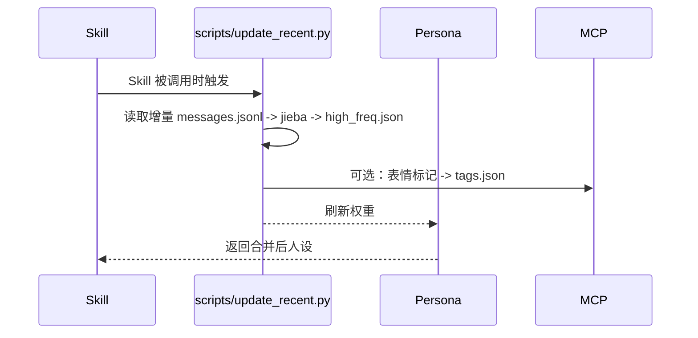

# 架构设计 - 轻量低耦合

## 原则
1. 单向依赖，上层调下层，下层不感知上层
2. 数据即接口：模块间通过 `data/*.json` 通信，不直接 import
3. 幂等可重放：scripts 可反复执行，增量更新

## 模块

| 模块 | 职责 | 输入 | 输出 |
|------|------|------|------|
| **collectors** | 拉取群消息/表情 | 群 API | `data/recent_messages/messages.jsonl`, `data/emojis/*.png` |
| **processors** | 清洗、分词、高频统计 | `data/recent_messages` | `data/keywords/high_freq.json` |
| **mcp-servers/emoji-tagger** | 表情语义标记（可选） | `data/emojis/*.png` | `data/emojis/tags.json` |
| **updater + scripts/update_recent.py** | 调度与权重计算 | 上述 data | `data/keywords/high_freq.json` 更新 |
| **persona** | 合并 immortal-skill + 动态权重 | `config/persona.json` + data | 最终 Prompt |

## 时序

## 耦合控制
- 换平台（QQ->Discord）仅重写 collectors
- 换分词方案仅改 processors，不影响 persona
- MCP 挂了不影响主链路（可选）
